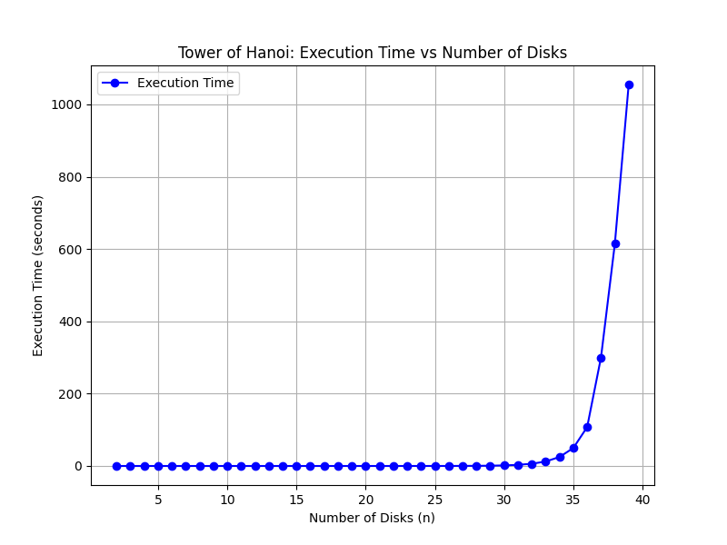

# Tower of Hanoi Analysis

This repository analyzes the **execution time of the Tower of Hanoi recursive algorithm** in C, and visualizes the results using Python (Matplotlib).

---

## 📌 Problem Statement

The **Tower of Hanoi** is a classic recursive problem where the goal is to move `n` disks from a source rod to a target rod using an auxiliary rod, following these rules:

1. Only one disk can be moved at a time.
2. A disk can only be placed on top of a larger disk.
3. All disks must be moved from the source rod to the target rod.

This project measures how the execution time grows as the number of disks increases.

---

## 🛠️ Implementation

### 1. C Program (Execution Time Measurement)

- Implements the recursive Tower of Hanoi function.
- Uses `time.h` library to measure execution time.
- Saves results (`Number of Disks, Time Taken`) into a **CSV file** (`hanoi_times.csv`).
- Includes proper exception handling for file operations.

📄 File: `main.c`

---

### 2. Python Program (Graph Plotting)

- Reads the generated **CSV file** using `pandas`.
- Uses `matplotlib` to plot **Execution Time vs Number of Disks**.

📄 File: `plot_graph.py`

---

## 📂 Project Structure

```
📦 Tower-Hanoi-Analysis
├── main.c      # C program to run Tower of Hanoi and store execution times
├── plot_graph.py      # Python script to visualize results
├── hanoi_times.csv    # Auto-generated CSV file with execution times
├── graph.png          # Generated graph of results
└── README.md          # Project documentation
```

## ▶️ How to Run

### Step 1: Compile and Run C Program

```bash
gcc main.c -o main
./main
```

## Run Python Script

```
python plot_graph.py
``` 
## Graph

